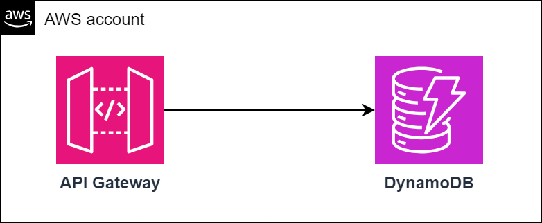

In the realm of cloud development, there's often a need for a local environment to test and develop applications before deploying them to production. LocalStack steps in to fill this gap, providing a cost saving solution for simulating AWS services locally. Let's delve into how LocalStack can transform your development workflow and enhance productivity.

## What is Localstack?
LocalStack is a powerful tool that replicates the AWS cloud environment on your local machine, enabling developers to develop and test their applications locally. By mimicking various AWS services, including but not limited to S3, DynamoDB, Lambda, and SQS, developers can build and iterate on their applications without incurring the costs associated with the AWS cloud or the complexities of managing AWS development accounts.
Explore more at https://www.localstack.cloud/

### 1. Prerequisites
As prerequisites, ensure that you have **Python** and **Docker** installed on your machine. Python is required to install the necessary tools for configuring your LocalStack environment. Docker is essential for building a communication network between the AWS CLI and LocalStack, facilitating interaction between the two services.

### 2. Create a LocalStack Account
Start by creating a LocalStack account, which can be easily done using your GitHub credentials for seamless authentication. Once logged in, you'll have access to the free Hobby Subscription, tailored for non-enterprise workloads.

### 3. Install LocalStack CLI
Install the LocalStack CLI, which serves as your gateway to the LocalStack environment.
```sh
sudo tar xvzf ~/Downloads/localstack-cli-3.0.2-linux-*-onefile.tar.gz -C /usr/local/bin
```
If you prefer, you can install it using **pip**:
```sh
python -m pip install --upgrade localstack
```

### 4. Install AWS CLI
Next, set up the AWS CLI to interact with LocalStack. This involves installing **AWS CLI v2** and configuring it with dummy credentials:
```sh
aws configure
AWS Access Key ID [None]: dummy
AWS Secret Access Key [None]: dummy
Default region name [None]: eu-west-1
Default output format [None]:
```
Additionally, install the AWS CLI wrapper for LocalStack:
```sh
python -m pip install awscli-local
```

### 5. Integrate Terraform
For infrastructure as code enthusiasts, LocalStack seamlessly integrates with Terraform. Begin by installing Terraform and the **tflocal** wrapper for LocalStack:
```sh
python -m pip install terraform-local
```

## Initializing LocalStack
With the prerequisites in place, it's time to initialize LocalStack for your development environment:
- Create a Docker network to facilitate communication between AWS CLI v2 and LocalStack:
```sh
docker network create localstack
```
- Set your personal token as an environment variable, essential for LocalStack event with a free account:
```sh
export LOCALSTACK_AUTH_TOKEN=<your token>
```
- Launch LocalStack:
```sh
localstack start
```
- Define environment variables for the Terraform wrapper:
```sh
export AWS_DEFAULT_REGION=eu-west-1
export AWS_ENDPOINT_URL=http://localhost:4566
```

## Deploying Infrastructure
Now you can explore its functionalities by trying out a simple pattern composed of **API Gateway** and **DynamoDB**.



- Navigate to the directory containing your Terraform files.
- Deploy your infrastructure in LocalStack using the Terraform wrapper with the following commands:
```sh
tflocal init
tflocal plan
tflocal apply --auto-approve
```
- Visualize the created resources on LocalStack by visiting: https://app.localstack.cloud/inst/default/status

## Testing
Now that your infrastructure is deployed on LocalStack, test its functionality by:
- Recovering the API key from terraform output
```sh
API_KEY=$(tflocal output -json | jq -r .apigw_key.value)
```
- Recovering the API id
```sh
REST_API=$(aws apigateway --endpoint-url=http://localhost:4566 get-rest-apis | jq -r '.items[0].id')
```
- Inserting data in DynamoDB via the POST API:
```sh
curl $REST_API.execute-api.localhost.localstack.cloud:4566/v1/pets -H "x-api-key: ${API_KEY}" -H 'Content-Type: application/json' --request POST --data-raw '{ "PetType": "dog", "PetName": "tito", "PetPrice": 250 }'
```
- Requesting the inserted data via the GET API
```sh
curl -H "x-api-key: ${API_KEY}" --request GET $REST_API.execute-api.localhost.localstack.cloud:4566/v1/pets/dog
```

## Cleaning up
- Do not forge to destroy the insfrastructure
```sh
tflocal destroy --auto-approve
```

## Conclusion
LocalStack offers a convenient and cost-effective solution for simulating AWS services locally. By leveraging LocalStack, developers can iterate faster, reduce costs, and mitigate the complexities associated with managing AWS development accounts.

The associated code is available [here](https://github.com/veben/aws_tf_apigateway_dynamodb) 