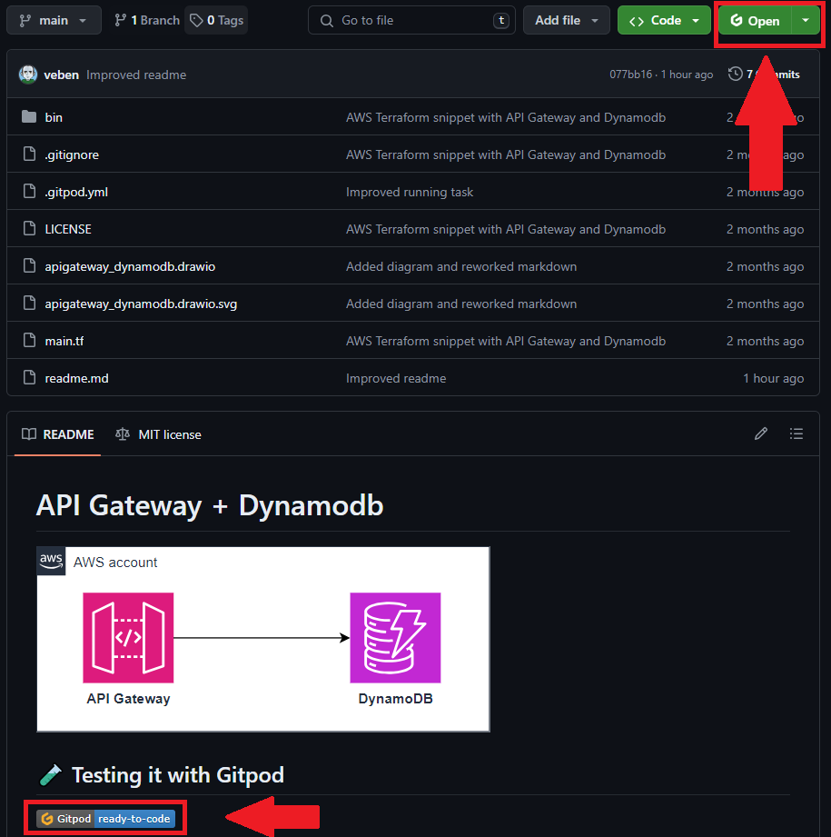
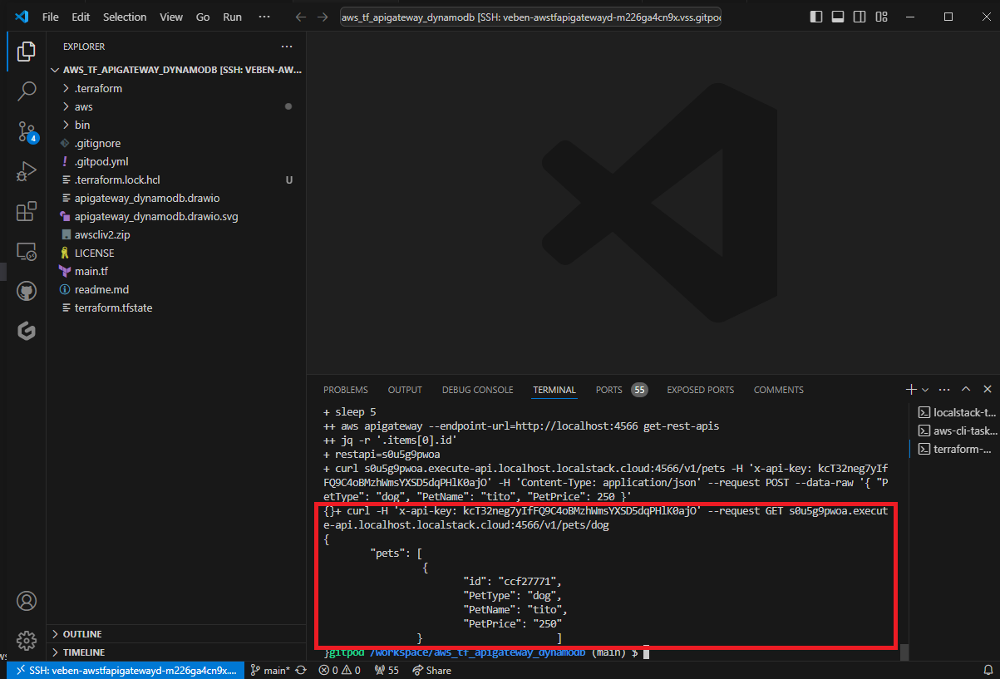

Gitpod offers a simple way to spin up ready-to-code development environments directly from your browser. In this post, we'll walk you through how to use Gitpod to set up a development environment for deploying an AWS infrastructure pattern using Terraform.

We'll build on the pattern explained in this [previous post](https://veben.github.io/localstack-tf-aws/), which allows deploying a simple infrastructure composed of **API Gateway** and **DynamoDB** at no cost with **LocalStack** and **Terraform**.

## What is Gitpod?
Gitpod is an online IDE that provides automated, pre-configured development environments. It enables developers to work efficiently by eliminating the setup time for development environments and ensuring consistency across different setups.

## Prerequisites
Before you start, ensure you have a GitHub account and access to the Gitpod service. You can sign up for a free Gitpod account [here](https://www.gitpod.io/).

To begin, start from [this repository](https://github.com/veben/aws_tf_apigateway_dynamodb) containing terraform files to deploy a simple pattern.

## Configuration
Inside your repository, create `.gitpod.yml` file to configure your Gitpod environment with the following tasks:
1. Installing and starting LocalStack.
2. Installing the AWS CLI and the `awscli-local` wrapper.
3. Installing Terraform and the `terraform-local` wrapper and running a custom script to:
    - create the infrastructure on LocalStack with Terraform
    - retrieve the API key from terraform output
    - retrieve the API id
    - insert data into DynamoDB via the POST API
    - request the inserted data via the GET API

Additionally, configure a range of ports to be exposed to make the pod accessible.

Here is the `.gitpod.yml` configuration:
```yaml
tasks:
  - name: localstack-task
    init: |
      python -m pip install localstack
    command: |
      . ~/.bash_profile
      docker network create localstack
      localstack start
  - name: aws-cli-task
    init: |
      curl "https://awscli.amazonaws.com/awscli-exe-linux-x86_64.zip" -o "awscliv2.zip"
      unzip awscliv2.zip
      sudo ./aws/install
      pip install awscli-local
  - name: terraform-wrapper-task
    env:
      AWS_ACCESS_KEY_ID: "dummy"
      AWS_SECRET_ACCESS_KEY: "dummy"
      AWS_DEFAULT_REGION: "eu-west-1"
    init: |
      curl -fsSL https://apt.releases.hashicorp.com/gpg | sudo apt-key add -
      sudo apt-add-repository "deb [arch=amd64] https://apt.releases.hashicorp.com $(lsb_release -cs) main" -y
      sudo apt-get update && sudo apt-get install terraform
      yes | pip install terraform-local
    command: |
      . ~/.bash_profile
      bash bin/run.sh

ports:
  - port: 3000-8999
    onOpen: ignore
```

And here is the `run.sh` script:

```sh
#!/usr/bin/env sh

set -x

tflocal init; tflocal plan; tflocal apply --auto-approve

apikey=$(tflocal output -json | jq -r .apigw_key.value)

sleep 5

restapi=$(aws apigateway --endpoint-url=http://localhost:4566 get-rest-apis | jq -r .items[0].id)

curl $restapi.execute-api.localhost.localstack.cloud:4566/v1/pets -H "x-api-key: ${apikey}" -H 'Content-Type: application/json' --request POST --data-raw '{ "PetType": "dog", "PetName": "tito", "PetPrice": 250 }'

curl -H "x-api-key: ${apikey}" --request GET $restapi.execute-api.localhost.localstack.cloud:4566/v1/pets/dog
```

## Launching
To launch the Gitpod environment, add `https://gitpod.io/#` before your repository URL. For our example it is `https://gitpod.io/#https://github.com/veben/aws_tf_apigateway_dynamodb`.

You can also configure a button in the `README.md` of the repository, or install Gitpod browser extension to create a button on top of repository code.



Then you can open the environment directly in your browser or in VSCode if you install the Gitpod extension.



Each task runs in a dedicated terminal.

You can see the result of the last command, which is the requested data from DynamoDB via the GET API.


## Conclusion
By following these steps, you've successfully set up a Gitpod environment to develop and test AWS applications locally using LocalStack, AWS CLI, and Terraform. This setup ensures you can efficiently build and test your infrastructure without incurring AWS costs.

The associated code is available [here](https://github.com/veben/aws_tf_apigateway_dynamodb) 