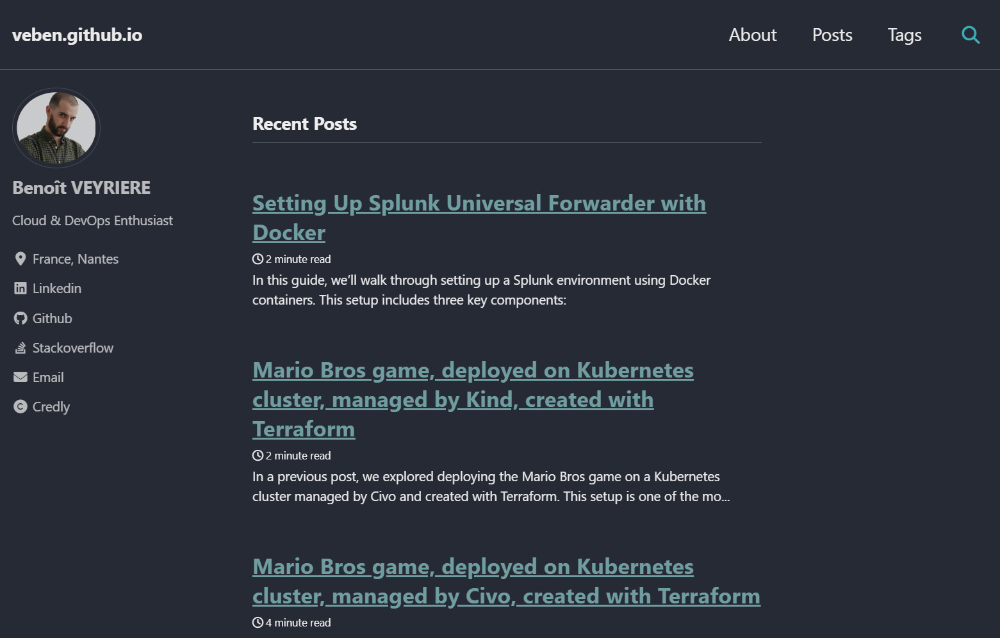

I'm excited to announce that I've just updated this blog with a brand-new theme for a cleaner and more modern look. Take a look at the transformation!

## The Old Theme:


## The New Look:


If you want to install a similar theme for your own blog, follow these simple steps:

## Getting Started
You can easily create your own blog by cloning the [Starter repository](https://github.com/mmistakes/mm-github-pages-starter) and customizing it to fit your needs.

## Customization
Most of the configurations are managed in the `_config.yml` file. For instance, you can change the theme's skin by adjusting the appropriate settings within this file.

To add a new post, simply create a Markdown file in the `_posts` directory following this naming convention: `YYYY-MM-DD-name-of-post.md`.

## Local Developement
Before publishing your blog, you might want to test it locally. Follow these steps to configure local environment:
1. Clone the repository
```sh
git clone https://github.com/<your-github-username>/<your-github-username>.github.io.git
```
2. Install required components. See [here](https://jekyllrb.com/docs/installation/ubuntu/)
3. Install required gems, listed in `Gemfile`
```sh
bundle install
```
4. Serve the site and watch for changes
```sh
bundle exec jekyll serve
```
5. Open your browser and navigate to http://127.0.0.1:4000/ to view your site locally

## Hosting on GitHub Pages
To host your blog on GitHub Pages, name your repository in this format: `<your-github-username>.github.io`. Each time you push changes to the main branch, your blog will be published automatically and accessible at `https://<your-github-username>.github.io`.

## Credits
- **Generated with**: [Ruby](https://www.ruby-lang.org/) and [Jekyll](https://jekyllrb.com/).
- **Hosted on**: [Github pages](https://pages.github.com/)
- **Theme**: Based on the [Minimal Mistakes](https://github.com/mmistakes/minimal-mistakes?tab=readme-ov-file) theme